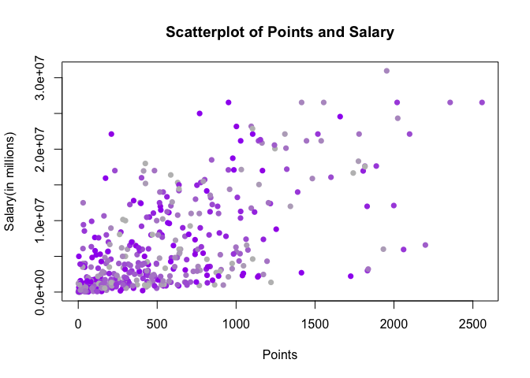
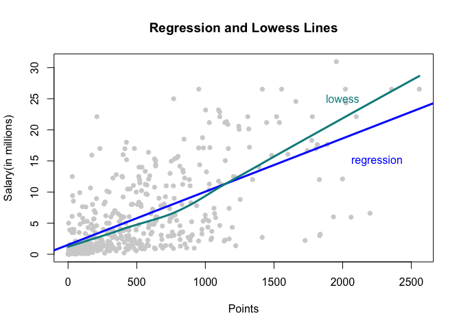
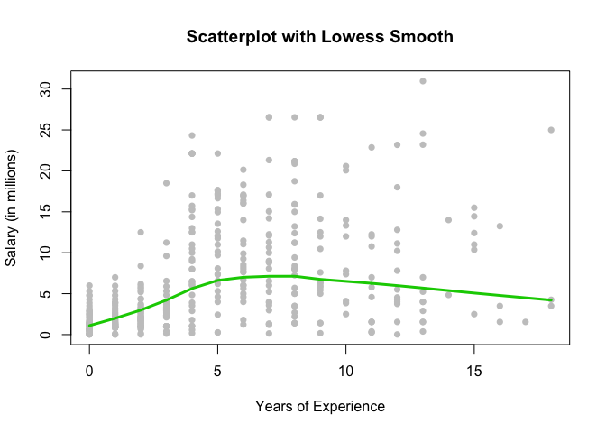
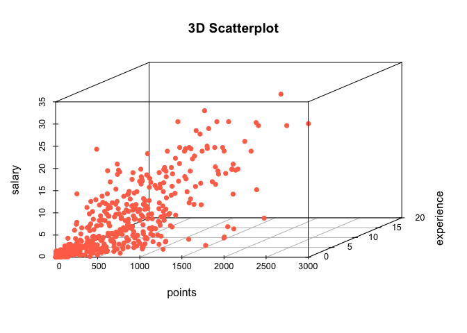
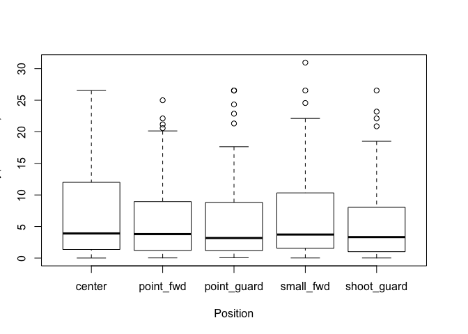

HW 1
================

``` r
library(knitr)
opts_chunk$set(tidy.opts=list(width.cutoff=80),tidy=TRUE)
```

R Markdown
----------

PART 1
======

``` r
# load data file
setwd("/Users/shivaniprabala/Desktop")
load("stat133/stat133-hws-fall17/hw01/data/nba2017-salary-points.RData")
```

``` r
# list the available objects
ls()
```

    ## [1] "experience" "player"     "points"     "points1"    "points2"   
    ## [6] "points3"    "position"   "salary"     "team"

``` r
# new salary variable measured in millions of dollars (2 decimal digits)
salary_inmillions <- round(salary/1e+06, 2)
```

``` r
# new experience variable as an integer vector with 'R' replaced by'0'
new_experience <- as.integer(replace(experience, experience == "R", "0"))
```

``` r
# new position vector as a factor with more descriptive labels for levels
position_description = c("center", "small_fwd", "power_fwd", "shoot_guard", "point_guard")
position_levels = c("C", "SF", "PF", "SG", "PG")
new_position <- factor(position, levels = position_levels, labels = position_description)
table(new_position)
```

    ## new_position
    ##      center   small_fwd   power_fwd shoot_guard point_guard 
    ##          89          83          89          95          85

PART2
=====

``` r
color <- colorRampPalette(c("purple", "gray"))
plot(points, salary, pch = 16, col = color(10), xlab = "Points", ylab = "Salary(in millions)", 
    main = "Scatterplot of Points and Salary", cex = 1, type = "p")
```



PART 3
======

``` r
# calculating linear correlation coefficients
n <- length(points)
x_bar <- (sum(points))/n
y_bar <- (sum(salary_inmillions))/n
var_x <- (sum((points - x_bar)^2))/(n - 1)
var_y <- (sum((salary_inmillions - y_bar)^2))/(n - 1)
sd_x <- sqrt(var_x)
sd_y <- sqrt(var_y)
conv_xy <- (sum((points - x_bar) * (salary_inmillions - y_bar)))/(n - 1)
corr_xy <- (conv_xy)/(sd_x * sd_y)
```

PART4
=====

``` r
# calculating simple linear regression slope
b1 <- corr_xy * (sd_y/sd_x)
# intercept
b0 <- y_bar - (b1 * x_bar)
# predicted values
y_hat <- b0 + (b1 * points)
# summary of statistics
summary(y_hat)
```

    ##    Min. 1st Qu.  Median    Mean 3rd Qu.    Max. 
    ##   1.509   2.844   5.206   6.187   8.184  23.400

##### Regression Equation

Equation of the line: `Y = 1.5090766 + 0.0085576X`

##### Interpretation of b1

I interpret `b1= 0.0085576` to be how much salary changes when the points value changes.

##### Interpretation of b0

I interpret `b0= 1.5090766` to be the point where points is equal to zero and the line meets the y-axis.

``` r
# 0 points
y_hat[points == 0]
```

    ## [1] 1.509077

``` r
# 100 points
y_hat[points == 100]
```

    ## [1] 2.364833

``` r
# 500 points
b0 + (b1 * 500)
```

    ## [1] 5.78786

``` r
# 1000 points
b0 + (b1 * 1000)
```

    ## [1] 10.06664

``` r
# 2000 points
b0 + (b1 * 2000)
```

    ## [1] 18.62421

PART5
=====

``` r
# Plotting the regression line
plot(points, salary_inmillions, xlab = "Points", ylab = "Salary(in millions)", main = "Regression and Lowess Lines", 
    col = "gray82", pch = 16)
abline(b0, b1, col = 4, lwd = 3)
lines(lowess(points, salary_inmillions), col = "darkcyan", lwd = 3)
text(2000, 25, "lowess", col = "darkcyan")
text(2250, 15, "regression", col = 4)
```



PART6
=====

``` r
residual_vector <- (salary_inmillions - y_hat)
summary(residual_vector)
```

    ##    Min. 1st Qu.  Median    Mean 3rd Qu.    Max. 
    ## -14.190  -2.792  -1.095   0.000   2.556  18.810

``` r
RSS <- sum((residual_vector)^2)
TSS <- sum((salary_inmillions - y_bar)^2)
R_squared <- 1 - (RSS/TSS)
```

PART7
=====

``` r
# Exploring Position and Experience
library("scatterplot3d", lib.loc = "/Library/Frameworks/R.framework/Versions/3.3/Resources/library")
# scatterplot of years-of-experience and salary including a lowess smooth line
plot(new_experience, salary_inmillions, xlab = "Years of Experience", ylab = "Salary (in millions)", 
    main = "Scatterplot with Lowess Smooth", pch = 16, col = "gray78")
lines(lowess(new_experience, salary_inmillions), col = 3, lwd = 3)
```



``` r
# This scatterplot graphs points against salary in millions of players in the
# NBA. The lowess line is a local polynomial regression fitting displaying the
# relation between the two variables. `

# 3D Scatterplot
scatterplot3d(points, new_experience, salary_inmillions, xlab = "points", ylab = "experience", 
    zlab = "salary", main = "3D Scatterplot", pch = 16, color = "coral1")
```



``` r
# This plot allows us to view a three-dimensional graph of the variables points,
# years of experience, and salary.


# Conditional boxplot of Salary in terms of position
boxplot(salary_inmillions[position == "C"], salary_inmillions[position == "PF"], 
    salary_inmillions[position == "PG"], salary_inmillions[position == "SF"], salary_inmillions[position == 
        "SG"], names = c("center", "point_fwd", "point_guard", "small_fwd", "shoot_guard"), 
    xlab = "Position", ylab = "Salary(in millions)")
```



``` r
# This boxplot allows us to view the relationship between points and salary
# separated by the position of the player.

# From observing the scatterplots, it is reasonable to say that as experience
# increase salary tends to increase as the general pattern. One could stipulate
# that experience and salary are positively related.

# From observng the boxplot, there does not seem to be a significant relation
# between position and salary. The median of salaries seem to be roughly in the
# same location for all positions. Similarly, the spread between the differently
# players seems roughly the same.
```

PART8
=====

``` r
# Comments and Reflections

# Remembering syntax on splicing/creating vectors is still a little difficult
# even though I saw them in class.

# Figuring out the different plot parameters was easy(-ish) even though we didn't
# go into too much detail on those in class.

# Yes, this is the first time I have used git. It's pretty confusing to be
# honest, but hopefully I'll understand it better soon.

# I did need help on installing the scatterplot3d package but I was able to
# figure it out by myself eventually.

# I would say that this assignment took me roughly 4 hours to complete.

# I had a bug where I could call scatterplot from the console and even run the
# chunk, but when I tried to knit the document it could not find scattplot. This
# took a while to fix, but hopefully next time I have a similar issue I can deal
# with it more quickly.

# I am not sure if we were supposed to create a function of the y_hat or to just
# apply the predictor formula to the given vector. I was a little unsure if we
# were supposed to for example in the points = 0, 100, 500, etc. question input
# those values into a function or just compute them using the parameters we
# calculated.

# Scatterplot3d was the most frustrating thing.

# I think figuring that bug out, and also seeing that I was able to generate the
# correct graphs was really encouraging. I had fun doing this homework. Thanks
# for designing it. :)
```
