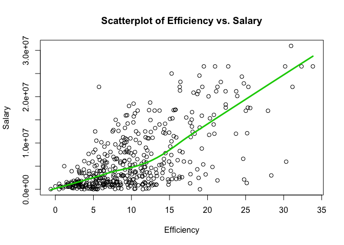
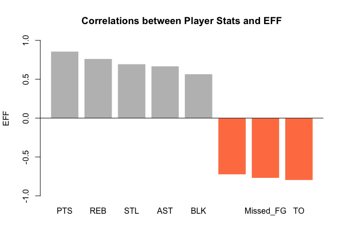
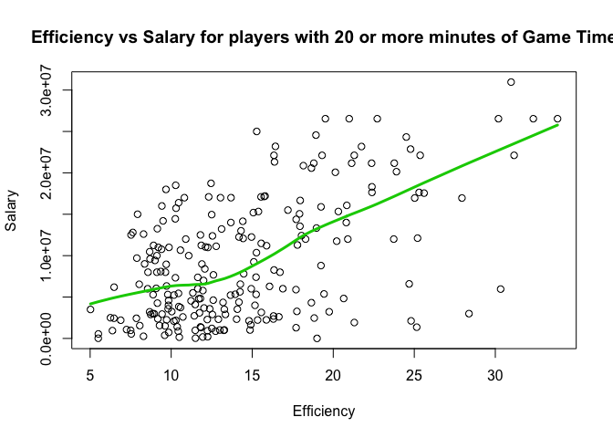

HW 02- Basics of Data Frames
================
Shivani Prabala
October 2nd, 2017

``` r
library(knitr)
opts_chunk$set(tidy.opts=list(width.cutoff= 80),tidy=TRUE)
```

PART2
=====

``` r
# importing use R base functions
github <- "https://github.com/ucb-stat133/stat133-fall-2017/raw/master/"
file <- "data/nba2017-player-statistics.csv"
csv <- paste0(github, file)
data_frame_base <- read.csv(csv, colClasses = c("character", "character", "factor", 
    "character", "double", rep("integer", 19)))
str(data_frame_base)
```

    ## 'data.frame':    441 obs. of  24 variables:
    ##  $ Player      : chr  "Al Horford" "Amir Johnson" "Avery Bradley" "Demetrius Jackson" ...
    ##  $ Team        : chr  "BOS" "BOS" "BOS" "BOS" ...
    ##  $ Position    : Factor w/ 5 levels "C","PF","PG",..: 1 2 5 3 4 3 4 5 4 2 ...
    ##  $ Experience  : chr  "9" "11" "6" "R" ...
    ##  $ Salary      : num  26540100 12000000 8269663 1450000 1410598 ...
    ##  $ Rank        : int  4 6 5 15 11 1 3 13 8 10 ...
    ##  $ Age         : int  30 29 26 22 31 27 26 21 20 29 ...
    ##  $ GP          : int  68 80 55 5 47 76 72 29 78 78 ...
    ##  $ GS          : int  68 77 55 0 0 76 72 0 20 6 ...
    ##  $ MIN         : int  2193 1608 1835 17 538 2569 2335 220 1341 1232 ...
    ##  $ FGM         : int  379 213 359 3 95 682 333 25 192 114 ...
    ##  $ FGA         : int  801 370 775 4 232 1473 720 58 423 262 ...
    ##  $ Points3     : int  86 27 108 1 39 245 157 12 46 45 ...
    ##  $ Points3_atts: int  242 66 277 1 111 646 394 35 135 130 ...
    ##  $ Points2     : int  293 186 251 2 56 437 176 13 146 69 ...
    ##  $ Points2_atts: int  559 304 498 3 121 827 326 23 288 132 ...
    ##  $ FTM         : int  108 67 68 3 33 590 176 6 85 26 ...
    ##  $ FTA         : int  135 100 93 6 41 649 217 9 124 37 ...
    ##  $ OREB        : int  95 117 65 2 17 43 48 6 45 60 ...
    ##  $ DREB        : int  369 248 269 2 68 162 367 20 175 213 ...
    ##  $ AST         : int  337 140 121 3 33 449 155 4 64 71 ...
    ##  $ STL         : int  52 52 68 0 9 70 72 10 35 26 ...
    ##  $ BLK         : int  87 62 11 0 7 13 23 2 18 17 ...
    ##  $ TO          : int  116 77 88 0 25 210 79 4 68 39 ...

``` r
# importing use reader package
library(readr)
data_frame_readr <- read_csv(csv, col_types = list(col_character(), col_character(), 
    col_factor(c("C", "PF", "PG", "SF", "SG")), col_character(), col_double(), col_integer(), 
    col_integer(), col_integer(), col_integer(), col_integer(), col_integer(), col_integer(), 
    col_integer(), col_integer(), col_integer(), col_integer(), col_integer(), col_integer(), 
    col_integer(), col_integer(), col_integer(), col_integer(), col_integer(), col_integer()))
str(data_frame_readr)
```

    ## Classes 'tbl_df', 'tbl' and 'data.frame':    441 obs. of  24 variables:
    ##  $ Player      : chr  "Al Horford" "Amir Johnson" "Avery Bradley" "Demetrius Jackson" ...
    ##  $ Team        : chr  "BOS" "BOS" "BOS" "BOS" ...
    ##  $ Position    : Factor w/ 5 levels "C","PF","PG",..: 1 2 5 3 4 3 4 5 4 2 ...
    ##  $ Experience  : chr  "9" "11" "6" "R" ...
    ##  $ Salary      : num  26540100 12000000 8269663 1450000 1410598 ...
    ##  $ Rank        : int  4 6 5 15 11 1 3 13 8 10 ...
    ##  $ Age         : int  30 29 26 22 31 27 26 21 20 29 ...
    ##  $ GP          : int  68 80 55 5 47 76 72 29 78 78 ...
    ##  $ GS          : int  68 77 55 0 0 76 72 0 20 6 ...
    ##  $ MIN         : int  2193 1608 1835 17 538 2569 2335 220 1341 1232 ...
    ##  $ FGM         : int  379 213 359 3 95 682 333 25 192 114 ...
    ##  $ FGA         : int  801 370 775 4 232 1473 720 58 423 262 ...
    ##  $ Points3     : int  86 27 108 1 39 245 157 12 46 45 ...
    ##  $ Points3_atts: int  242 66 277 1 111 646 394 35 135 130 ...
    ##  $ Points2     : int  293 186 251 2 56 437 176 13 146 69 ...
    ##  $ Points2_atts: int  559 304 498 3 121 827 326 23 288 132 ...
    ##  $ FTM         : int  108 67 68 3 33 590 176 6 85 26 ...
    ##  $ FTA         : int  135 100 93 6 41 649 217 9 124 37 ...
    ##  $ OREB        : int  95 117 65 2 17 43 48 6 45 60 ...
    ##  $ DREB        : int  369 248 269 2 68 162 367 20 175 213 ...
    ##  $ AST         : int  337 140 121 3 33 449 155 4 64 71 ...
    ##  $ STL         : int  52 52 68 0 9 70 72 10 35 26 ...
    ##  $ BLK         : int  87 62 11 0 7 13 23 2 18 17 ...
    ##  $ TO          : int  116 77 88 0 25 210 79 4 68 39 ...
    ##  - attr(*, "spec")=List of 2
    ##   ..$ cols   :List of 24
    ##   .. ..$ Player      : list()
    ##   .. .. ..- attr(*, "class")= chr  "collector_character" "collector"
    ##   .. ..$ Team        : list()
    ##   .. .. ..- attr(*, "class")= chr  "collector_character" "collector"
    ##   .. ..$ Position    :List of 3
    ##   .. .. ..$ levels    : chr  "C" "PF" "PG" "SF" ...
    ##   .. .. ..$ ordered   : logi FALSE
    ##   .. .. ..$ include_na: logi FALSE
    ##   .. .. ..- attr(*, "class")= chr  "collector_factor" "collector"
    ##   .. ..$ Experience  : list()
    ##   .. .. ..- attr(*, "class")= chr  "collector_character" "collector"
    ##   .. ..$ Salary      : list()
    ##   .. .. ..- attr(*, "class")= chr  "collector_double" "collector"
    ##   .. ..$ Rank        : list()
    ##   .. .. ..- attr(*, "class")= chr  "collector_integer" "collector"
    ##   .. ..$ Age         : list()
    ##   .. .. ..- attr(*, "class")= chr  "collector_integer" "collector"
    ##   .. ..$ GP          : list()
    ##   .. .. ..- attr(*, "class")= chr  "collector_integer" "collector"
    ##   .. ..$ GS          : list()
    ##   .. .. ..- attr(*, "class")= chr  "collector_integer" "collector"
    ##   .. ..$ MIN         : list()
    ##   .. .. ..- attr(*, "class")= chr  "collector_integer" "collector"
    ##   .. ..$ FGM         : list()
    ##   .. .. ..- attr(*, "class")= chr  "collector_integer" "collector"
    ##   .. ..$ FGA         : list()
    ##   .. .. ..- attr(*, "class")= chr  "collector_integer" "collector"
    ##   .. ..$ Points3     : list()
    ##   .. .. ..- attr(*, "class")= chr  "collector_integer" "collector"
    ##   .. ..$ Points3_atts: list()
    ##   .. .. ..- attr(*, "class")= chr  "collector_integer" "collector"
    ##   .. ..$ Points2     : list()
    ##   .. .. ..- attr(*, "class")= chr  "collector_integer" "collector"
    ##   .. ..$ Points2_atts: list()
    ##   .. .. ..- attr(*, "class")= chr  "collector_integer" "collector"
    ##   .. ..$ FTM         : list()
    ##   .. .. ..- attr(*, "class")= chr  "collector_integer" "collector"
    ##   .. ..$ FTA         : list()
    ##   .. .. ..- attr(*, "class")= chr  "collector_integer" "collector"
    ##   .. ..$ OREB        : list()
    ##   .. .. ..- attr(*, "class")= chr  "collector_integer" "collector"
    ##   .. ..$ DREB        : list()
    ##   .. .. ..- attr(*, "class")= chr  "collector_integer" "collector"
    ##   .. ..$ AST         : list()
    ##   .. .. ..- attr(*, "class")= chr  "collector_integer" "collector"
    ##   .. ..$ STL         : list()
    ##   .. .. ..- attr(*, "class")= chr  "collector_integer" "collector"
    ##   .. ..$ BLK         : list()
    ##   .. .. ..- attr(*, "class")= chr  "collector_integer" "collector"
    ##   .. ..$ TO          : list()
    ##   .. .. ..- attr(*, "class")= chr  "collector_integer" "collector"
    ##   ..$ default: list()
    ##   .. ..- attr(*, "class")= chr  "collector_guess" "collector"
    ##   ..- attr(*, "class")= chr "col_spec"

PART3
=====

``` r
# Data processing on Experience
data_frame_base$Experience[data_frame_base$Experience == "R"] <- 0  #replacing all values of 'R' with 0
data_frame_base$Experience <- as.integer(data_frame_base$Experience)  #converting Experience to integer 
class(data_frame_base$Experience)
```

    ## [1] "integer"

``` r
str(data_frame_base)
```

    ## 'data.frame':    441 obs. of  24 variables:
    ##  $ Player      : chr  "Al Horford" "Amir Johnson" "Avery Bradley" "Demetrius Jackson" ...
    ##  $ Team        : chr  "BOS" "BOS" "BOS" "BOS" ...
    ##  $ Position    : Factor w/ 5 levels "C","PF","PG",..: 1 2 5 3 4 3 4 5 4 2 ...
    ##  $ Experience  : int  9 11 6 0 9 5 4 2 0 6 ...
    ##  $ Salary      : num  26540100 12000000 8269663 1450000 1410598 ...
    ##  $ Rank        : int  4 6 5 15 11 1 3 13 8 10 ...
    ##  $ Age         : int  30 29 26 22 31 27 26 21 20 29 ...
    ##  $ GP          : int  68 80 55 5 47 76 72 29 78 78 ...
    ##  $ GS          : int  68 77 55 0 0 76 72 0 20 6 ...
    ##  $ MIN         : int  2193 1608 1835 17 538 2569 2335 220 1341 1232 ...
    ##  $ FGM         : int  379 213 359 3 95 682 333 25 192 114 ...
    ##  $ FGA         : int  801 370 775 4 232 1473 720 58 423 262 ...
    ##  $ Points3     : int  86 27 108 1 39 245 157 12 46 45 ...
    ##  $ Points3_atts: int  242 66 277 1 111 646 394 35 135 130 ...
    ##  $ Points2     : int  293 186 251 2 56 437 176 13 146 69 ...
    ##  $ Points2_atts: int  559 304 498 3 121 827 326 23 288 132 ...
    ##  $ FTM         : int  108 67 68 3 33 590 176 6 85 26 ...
    ##  $ FTA         : int  135 100 93 6 41 649 217 9 124 37 ...
    ##  $ OREB        : int  95 117 65 2 17 43 48 6 45 60 ...
    ##  $ DREB        : int  369 248 269 2 68 162 367 20 175 213 ...
    ##  $ AST         : int  337 140 121 3 33 449 155 4 64 71 ...
    ##  $ STL         : int  52 52 68 0 9 70 72 10 35 26 ...
    ##  $ BLK         : int  87 62 11 0 7 13 23 2 18 17 ...
    ##  $ TO          : int  116 77 88 0 25 210 79 4 68 39 ...

PART4
=====

``` r
library(dplyr)
```

    ## 
    ## Attaching package: 'dplyr'

    ## The following objects are masked from 'package:stats':
    ## 
    ##     filter, lag

    ## The following objects are masked from 'package:base':
    ## 
    ##     intersect, setdiff, setequal, union

``` r
# Missed field goals = attempted field goals - successful field goals
data_frame_base <- mutate(data_frame_base, Missed_FG = data_frame_base$FGA - data_frame_base$FGM)
# Missed free throws = attempted free throws - free throws made
data_frame_base <- mutate(data_frame_base, Missed_FT = data_frame_base$FTA - data_frame_base$FTM)
# Points total
data_frame_base <- mutate(data_frame_base, PTS = (data_frame_base$Points3 * 3) + 
    (data_frame_base$Points2 * 2) + data_frame_base$FTM)
# Total REB= offensive rebounds + defesive rebounds
data_frame_base <- mutate(data_frame_base, REB = data_frame_base$OREB + data_frame_base$DREB)
# Minutes per game = minutes played/ number of games played
data_frame_base <- mutate(data_frame_base, MPG = data_frame_base$MIN/data_frame_base$GP)
# Adding the EFF column
data_frame_base <- mutate(data_frame_base, EFF = ((data_frame_base$PTS + data_frame_base$REB + 
    data_frame_base$AST + data_frame_base$STL + data_frame_base$BLK - data_frame_base$Missed_FG - 
    data_frame_base$Missed_FT - data_frame_base$TO)/data_frame_base$GP))
# Summary statistics of EFF
summary(data_frame_base$EFF)
```

    ##    Min. 1st Qu.  Median    Mean 3rd Qu.    Max. 
    ##  -0.600   5.452   9.090  10.140  13.250  33.840

``` r
# histogram for EFF
hist(data_frame_base$EFF, xlab = "EFF", main = "History of Efficiency(EFF)", col = "grey")
```



``` r
dftop10 <- slice(select(arrange(data_frame_base, desc(EFF)), Player, Team, Salary, 
    EFF), 1:10)
dftop10
```

    ## # A tibble: 10 x 4
    ##                   Player  Team   Salary      EFF
    ##                    <chr> <chr>    <dbl>    <dbl>
    ##  1     Russell Westbrook   OKC 26540100 33.83951
    ##  2          James Harden   HOU 26540100 32.34568
    ##  3         Anthony Davis   NOP 22116750 31.16000
    ##  4          LeBron James   CLE 30963450 30.97297
    ##  5    Karl-Anthony Towns   MIN  5960160 30.32927
    ##  6          Kevin Durant   GSW 26540100 30.19355
    ##  7 Giannis Antetokounmpo   MIL  2995421 28.37500
    ##  8      DeMarcus Cousins   NOP 16957900 27.94118
    ##  9          Jimmy Butler   CHI 17552209 25.60526
    ## 10      Hassan Whiteside   MIA 22116750 25.36364

``` r
data_frame_base$Player[data_frame_base$EFF < 0]
```

    ## [1] "Patricio Garino"

``` r
# correlations between EFF and all variables used in EFF formula correlation
# between EFF and Missed_FG
Missed_FG <- -cor(data_frame_base$EFF, data_frame_base$Missed_FG)
Missed_FG
```

    ## [1] -0.7722477

``` r
# correlation between EFF and Missed_FT
Missed_FT <- -cor(data_frame_base$EFF, data_frame_base$Missed_FT)
Missed_FT
```

    ## [1] -0.7271456

``` r
# correlation between EFF and PTS
PTS <- cor(data_frame_base$EFF, data_frame_base$PTS)
PTS
```

    ## [1] 0.8588644

``` r
# correlation between EFF and REB
REB <- cor(data_frame_base$EFF, data_frame_base$REB)
REB
```

    ## [1] 0.7634501

``` r
# correlation between EFF and AST
AST <- cor(data_frame_base$EFF, data_frame_base$AST)
AST
```

    ## [1] 0.6689232

``` r
# correlation between EFF and STL
STL <- cor(data_frame_base$EFF, data_frame_base$STL)
STL
```

    ## [1] 0.6957286

``` r
# correlation between EFF and BLK
BLK <- cor(data_frame_base$EFF, data_frame_base$BLK)
BLK
```

    ## [1] 0.5679571

``` r
# correlation between EFF and TO
TO <- -cor(data_frame_base$EFF, data_frame_base$TO)
TO
```

    ## [1] -0.8003289

``` r
# Making a data frame and barplot with correlations
names <- c("Missed_FG", "Missed_FT", "PTS", "REB", "AST", "STL", "BLK", "TO")
numbers <- c(Missed_FG, Missed_FT, PTS, REB, AST, STL, BLK, TO)
dfcor_dec <- data.frame(names, numbers)
dfcor_dec <- arrange(dfcor_dec, desc(numbers))
barplot(dfcor_dec$numbers, names.arg = dfcor_dec$names, main = "Correlations between Player Stats and EFF", 
    ylim = c(-1, 1), col = c("gray", "gray", "gray", "gray", "gray", "coral", "coral", 
        "coral"), ylab = "EFF", border = "white")
abline(h = 0)
```



PART5
=====

``` r
# Scatterplot between Efficiency and Salary
plot(data_frame_base$EFF, data_frame_base$Salary, xlab = "Efficiency", ylab = "Salary", 
    main = "Scatterplot of Efficiency vs. Salary")
lines(lowess(data_frame_base$EFF, data_frame_base$Salary), col = 3, lwd = 3)
```


``` r
saleffcorr <- cor(data_frame_base$EFF, data_frame_base$Salary)
saleffcorr
```

    ## [1] 0.655624

###### Based on the positive association viewed on the scatterplot and the linear correlation coefficient of 0.655624, I would say that Efficiency and Salary have a moderate to strong positive relationship to one another.

``` r
MPG_morethan20players <- data_frame_base[data_frame_base$MPG >= 20, ]
players2 <- data.frame(MPG_morethan20players)
plot(players2$EFF, players2$Salary, main = "Efficiency vs Salary for players with 20 or more minutes of Game Time", 
    xlab = "Efficiency", ylab = "Salary")
lines(lowess(players2$EFF, players2$Salary), col = 3, lwd = 3)
```



``` r
cor_morethan20 <- cor(players2$EFF, players2$Salary)
cor_morethan20
```

    ## [1] 0.5367224

###### Based on the positive association viewed on the scatterplot and the linear correlation coefficient of 0.5367224, I would say that Efficiency and Salary have a moderate positive relationship to one another. This correlation coefficient is less than the coefficient using all player data, which suggests that for more experienced players the positive association between Efficiency and Salary is less strong. This could be for a number of reasons such as loyalty to the team having a higher precedence than efficiency or fan's pressure for a team to keep a certain player.

PART6
=====

-   Remembering how to access certain parts of data frames was hard, even though I saw them in class.
-   Figuring out how to use cor() was pretty easy even though we hadn't seen it in class.
-   I needed help from my GSI to fix an error in reading the csv files. I realized that I just needed to use the library function.
-   It took me about 3 hours to complete this assignment.
-   The most time consuming part was figuring out how to read the files use read.csv() and read\_csv().
-   I did not fully understand when to use R base functions to access information inside data frames, versus when to use the dplyr functions.
-   Nothing was particularly frustrating to me.
-   I liked seeing the graphs match up to the solution graphs, and figuring out diffiult parts of the lab myself.
