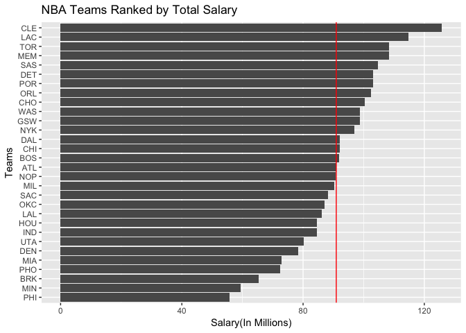
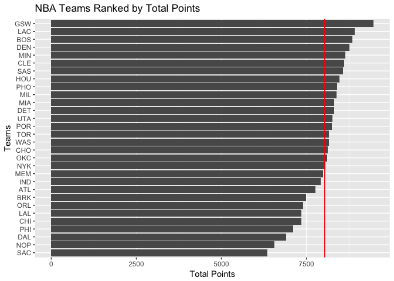
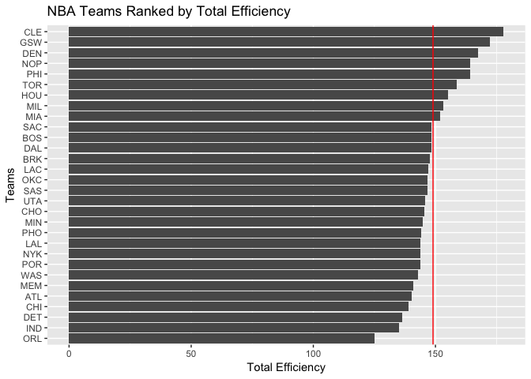
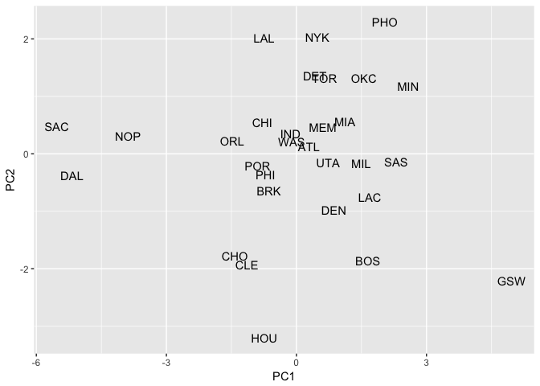
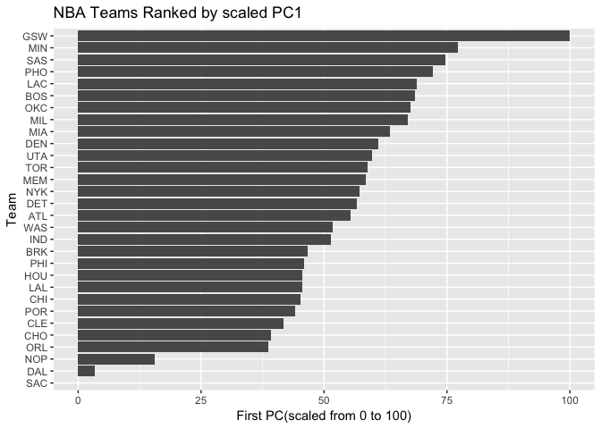

HW-03: Ranking NBA Teams
================

``` r
library(ggplot2)
library(dplyr)
```

    ## 
    ## Attaching package: 'dplyr'

    ## The following objects are masked from 'package:stats':
    ## 
    ##     filter, lag

    ## The following objects are masked from 'package:base':
    ## 
    ##     intersect, setdiff, setequal, union

``` r
teams <- read.csv("../data/nba2017-teams.csv")
#Teams Ranked By Salary 
ggplot(teams, aes(x=reorder(team, salary), y=salary)) + geom_bar(stat="identity") + labs(x="Teams", y="Salary(In Millions)", title="NBA Teams Ranked by Total Salary") + coord_flip() + geom_hline(yintercept = mean(teams$salary), colour="red")
```



``` r
#Teams Ranked By Points 
ggplot(teams, aes(x=reorder(team, points), y=points)) + geom_bar(stat="identity") + labs(x="Teams", y="Total Points", title="NBA Teams Ranked by Total Points") + coord_flip() + geom_hline(yintercept = mean(teams$points), colour="red")
```



``` r
#Teams Ranked By Efficiency
ggplot(teams, aes(x=reorder(team, efficiency), y=efficiency)) + geom_bar(stat="identity") + labs(x="Teams", y="Total Efficiency", title="NBA Teams Ranked by Total Efficiency") + coord_flip() + geom_hline(yintercept = mean(teams$efficiency), colour="red")
```



``` r
#Principal Component Analysis 
PCA <- prcomp(select(teams, points3, points2, free_throws, off_rebounds, def_rebounds, assists, steals, blocks, turnovers, fouls), scale.=TRUE)
eigs <- data.frame(eigenvalue=(PCA$sdev)^2, prop= round((PCA$sdev^2)/sum(PCA$sdev^2), 6))
eigs<- mutate(eigs, cumprop= cumsum(eigs$prop))
eigs 
```

    ##    eigenvalue     prop  cumprop
    ## 1  4.69588631 0.469589 0.469589
    ## 2  1.70201009 0.170201 0.639790
    ## 3  0.97952464 0.097952 0.737742
    ## 4  0.77171938 0.077172 0.814914
    ## 5  0.53408824 0.053409 0.868323
    ## 6  0.47801622 0.047802 0.916125
    ## 7  0.38220374 0.038220 0.954345
    ## 8  0.26026243 0.026026 0.980371
    ## 9  0.13359274 0.013359 0.993730
    ## 10 0.06269622 0.006270 1.000000

``` r
val <- data.frame(team=teams$team, PCA$x)
ggplot(val, aes(x=PC1, y=PC2)) + geom_text(aes(label=val$team))
```



``` r
s1 <- (100) * ((val$PC1 - min(val$PC1))/(max(val$PC1)-min(val$PC1)))
df2 <- data.frame(team=val$team, s1)
ggplot(df2, aes(x=reorder(team, s1), y=s1)) + geom_bar(stat="identity") + labs(x="Team", y="First PC(scaled from 0 to 100)", title="NBA Teams Ranked by scaled PC1") + coord_flip() 
```


