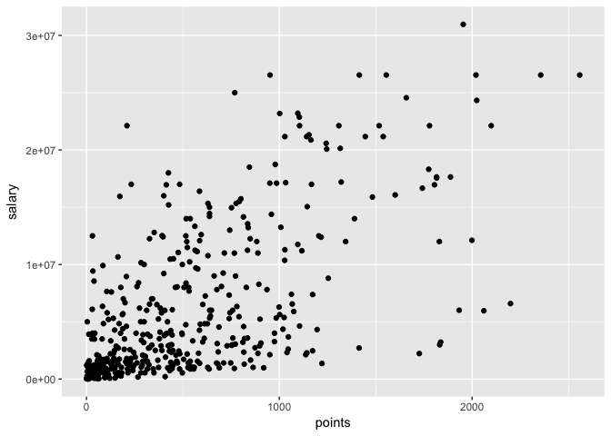
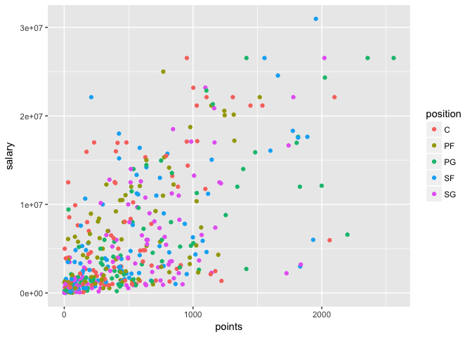
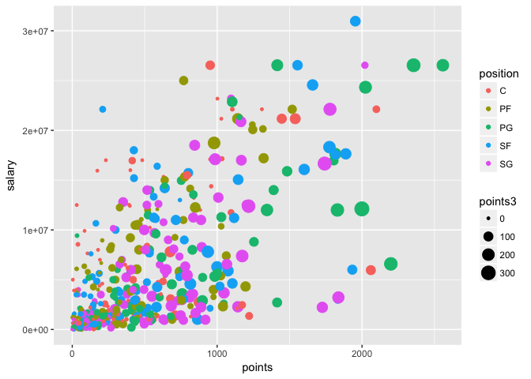

Lab 5: First contact with dplyr and ggplot2
================
Gaston Sanchez

> ### Learning Objectives:
>
> -   Get started with `"dplyr"`
> -   Get to know the basic dplyr verbs:
> -   `slice()`, `filter()`, `select()`
> -   `mutate()`
> -   `arrange()`
> -   `summarise()`
> -   `group_by()`
> -   Get started with `"ggplot2"`
> -   Produce basic plots with `ggplot()`

------------------------------------------------------------------------

Manipulating and Visualizing Data Frames
----------------------------------------

Last week you started to manipulate data tables (under the class of `"data.frame"` objects) using bracket notation, `dat[ , ]`, and the dollar operator, `dat$name`, in order to select specific rows, columns, or cells. In addition, you have been creating charts with functions like `plot()`, `boxplot()`, and `barplot()`, which are part of the `"graphics"` package.

In this lab, you will start learning about other approaches to manipulate tables and create statistical charts. We are going to use the functionality of the package `"dplyr"` to work with tabular data in a more consistent way. This is a fairly recent package introduced a couple of years ago, but it is based on more than a decade of research and work lead by Hadley Wickham.

Likewise, to create graphics in a more consistent and visually pleasing way, we are going to use the package `"ggplot2"`, also originally authored by Hadley Wickham, and developed as part of his PhD more than a decade ago.

Use the first hour of the lab to get as far as possible with the material associated to `"dplyr"`. Then use the second hour of the lab to work on graphics with `"ggplot2"` (all the material is in this file).

While you follow this lab, you may want to open these cheat sheets:

-   [dplyr cheatsheet](../cheat-sheets/data-transformation-cheatsheet.pdf)
-   [ggplot2 cheatsheet](../cheat-sheets/ggplot2-cheatsheet-2.1.pdf)

### Installing packages

I'm assuming that you already installed the packages `"dplyr"` and `"ggplot2"`. If that's not the case then run on the console the command below (do NOT include this in your `Rmd`):

``` r
# don't worry too much if you get a warning message
install.packages(c("dplyr", "ggplot2"))
```

Remember that you only need to install a package once! After a package has been installed in your machine, there is no need to call `install.packages()` again on the same package. What you should always invoke in order to use the functions in a package is the `library()` function:

``` r
# don't forget to load the packages
library(dplyr)
library(ggplot2)
```

**About loading packages:** Another rule to keep in mind is to always load any required packages at the very top of your script files (`.R` or `.Rmd` or `.Rnw` files). Avoid calling the `library()` function in the middle of a script. Instead, load all the packages before anything else.

------------------------------------------------------------------------

NBA Players Data
----------------

The data file for this lab is the same you used last week: `nba2017-players.csv`, which is located in the `data/` folder of the course github repository. I assume that you already downloaded a copy of the csv file to your computer. If that is not the case, here's one option to get your own copy:

``` r
# download RData file into your working directory
github <- "https://github.com/ucb-stat133/stat133-fall-2017/raw/master/"
csv <- "data/nba2017-players.csv"
download.file(url = paste0(github, csv), destfile = 'nba2017-players.csv')
```

To import the data in R you can use the base function `read.csv()`, or you can also use `read_csv()` from the package `"readr"`:

``` r
# with "base" read.csv()
dat <- read.csv('nba2017-players.csv', stringsAsFactors = FALSE)

# with "readr" read_csv()
dat <- read_csv('nba2017-players.csv')
```

``` r
# with "base" read.csv()
dat <- read.csv('nba2017-players.csv', stringsAsFactors = FALSE)
```

------------------------------------------------------------------------

Basic `"dplyr"` verbs
---------------------

To make the learning process of `"dplyr"` gentler, Hadley Wickham proposes beginning with a set of five *basic verbs* or operations for data frames (each verb corresponds to a function in `"dplyr"`):

-   **filter**: keep rows matching criteria
-   **select**: pick columns by name
-   **mutate**: add new variables
-   **arrange**: reorder rows
-   **summarise**: reduce variables to values

I've modified Hadley's list of verbs a little bit:

-   `filter()`, `slice()`, and `select()`: subsetting and selecting rows and columns
-   `mutate()`: add new variables
-   `arrange()`: reorder rows
-   `summarise()`: reduce variables to values
-   `group_by()`: grouped (aggregate) operations

------------------------------------------------------------------------

Filtering, slicing, and selecting
---------------------------------

`slice()` allows you to select rows by position:

``` r
# first three rows
three_rows <- slice(dat, 1:3)
three_rows
```

    ## # A tibble: 3 x 15
    ##          player  team position height weight   age experience
    ##           <chr> <chr>    <chr>  <int>  <int> <int>      <int>
    ## 1    Al Horford   BOS        C     82    245    30          9
    ## 2  Amir Johnson   BOS       PF     81    240    29         11
    ## 3 Avery Bradley   BOS       SG     74    180    26          6
    ## # ... with 8 more variables: college <chr>, salary <dbl>, games <int>,
    ## #   minutes <int>, points <int>, points3 <int>, points2 <int>,
    ## #   points1 <int>

`filter()` allows you to select rows by condition:

``` r
# subset rows given a condition
# (height greater than 85 inches)
gt_85 <- filter(dat, height > 85)
gt_85
```

    ##               player team position height weight age experience
    ## 1        Edy Tavares  CLE        C     87    260  24          1
    ## 2   Boban Marjanovic  DET        C     87    290  28          1
    ## 3 Kristaps Porzingis  NYK       PF     87    240  21          1
    ## 4        Roy Hibbert  DEN        C     86    270  30          8
    ## 5      Alexis Ajinca  NOP        C     86    248  28          6
    ##                 college  salary games minutes points points3 points2
    ## 1                          5145     1      24      6       0       3
    ## 2                       7000000    35     293    191       0      72
    ## 3                       4317720    66    2164   1196     112     331
    ## 4 Georgetown University 5000000     6      11      4       0       2
    ## 5                       4600000    39     584    207       0      89
    ##   points1
    ## 1       0
    ## 2      47
    ## 3     198
    ## 4       0
    ## 5      29

`select()` allows you to select columns by name:

``` r
# columns by name
player_height <- select(dat, player, height)
```

### Your turn:

-   use `slice()` to subset the data by selecting the first 5 rows.
-   use `slice()` to subset the data by selecting rows 10, 15, 20, ..., 50.
-   use `slice()` to subset the data by selecting the last 5 rows.
-   use `filter()` to subset those players with height less than 70 inches tall.
-   use `filter()` to subset rows of Golden State Warriors ('GSW').
-   use `filter()` to subset rows of GSW centers ('C').
-   use `filter()` and then `select()`, to subset rows of lakers ('LAL'), and then display their names.
-   use `filter()` and then `select()`, to display the name and salary, of GSW point guards
-   find how to select the name, age, and team, of players with more than 10 years of experience, making 10 million dollars or less.
-   find how to select the name, team, height, and weight, of rookie players, 20 years old, displaying only the first five occurrences (i.e. rows)

Your turn ANSWERS:
------------------

``` r
library(dplyr)
library(ggplot2)

five_rows <- slice(dat, 1:5)
five_rows 
```

    ## # A tibble: 5 x 15
    ##              player  team position height weight   age experience
    ##               <chr> <chr>    <chr>  <int>  <int> <int>      <int>
    ## 1        Al Horford   BOS        C     82    245    30          9
    ## 2      Amir Johnson   BOS       PF     81    240    29         11
    ## 3     Avery Bradley   BOS       SG     74    180    26          6
    ## 4 Demetrius Jackson   BOS       PG     73    201    22          0
    ## 5      Gerald Green   BOS       SF     79    205    31          9
    ## # ... with 8 more variables: college <chr>, salary <dbl>, games <int>,
    ## #   minutes <int>, points <int>, points3 <int>, points2 <int>,
    ## #   points1 <int>

``` r
every_five <- slice(dat, seq(10, 50, 5))
every_five
```

    ## # A tibble: 9 x 15
    ##             player  team position height weight   age experience
    ##              <chr> <chr>    <chr>  <int>  <int> <int>      <int>
    ## 1    Jonas Jerebko   BOS       PF     82    231    29          6
    ## 2     Tyler Zeller   BOS        C     84    253    27          4
    ## 3      Edy Tavares   CLE        C     87    260    24          1
    ## 4       Kevin Love   CLE       PF     82    251    28          8
    ## 5 Tristan Thompson   CLE        C     81    238    25          5
    ## 6  DeMarre Carroll   TOR       SF     80    215    30          7
    ## 7   Lucas Nogueira   TOR        C     84    241    24          2
    ## 8      Serge Ibaka   TOR       PF     82    235    27          7
    ## 9    Daniel Ochefu   WAS        C     83    245    23          0
    ## # ... with 8 more variables: college <chr>, salary <dbl>, games <int>,
    ## #   minutes <int>, points <int>, points3 <int>, points2 <int>,
    ## #   points1 <int>

``` r
last_five <- slice(dat, seq(437, 441))
last_five
```

    ## # A tibble: 5 x 15
    ##            player  team position height weight   age experience
    ##             <chr> <chr>    <chr>  <int>  <int> <int>      <int>
    ## 1 Marquese Chriss   PHO       PF     82    233    19          0
    ## 2    Ronnie Price   PHO       PG     74    190    33         11
    ## 3     T.J. Warren   PHO       SF     80    230    23          2
    ## 4      Tyler Ulis   PHO       PG     70    150    21          0
    ## 5  Tyson Chandler   PHO        C     85    240    34         15
    ## # ... with 8 more variables: college <chr>, salary <dbl>, games <int>,
    ## #   minutes <int>, points <int>, points3 <int>, points2 <int>,
    ## #   points1 <int>

``` r
shorter_than_70 <- filter(dat, height<70)
shorter_than_70
```

    ##          player team position height weight age experience
    ## 1 Isaiah Thomas  BOS       PG     69    185  27          5
    ## 2    Kay Felder  CLE       PG     69    176  21          0
    ##                    college  salary games minutes points points3 points2
    ## 1 University of Washington 6587132    76    2569   2199     245     437
    ## 2       Oakland University  543471    42     386    166       7      55
    ##   points1
    ## 1     590
    ## 2      35

``` r
subset_GSWrows<- filter(dat, team== "GSW")
subset_GSWrows
```

    ##                  player team position height weight age experience
    ## 1        Andre Iguodala  GSW       SF     78    215  33         12
    ## 2          Damian Jones  GSW        C     84    245  21          0
    ## 3            David West  GSW        C     81    250  36         13
    ## 4        Draymond Green  GSW       PF     79    230  26          4
    ## 5             Ian Clark  GSW       SG     75    175  25          3
    ## 6  James Michael McAdoo  GSW       PF     81    230  24          2
    ## 7          JaVale McGee  GSW        C     84    270  29          8
    ## 8          Kevin Durant  GSW       SF     81    240  28          9
    ## 9          Kevon Looney  GSW        C     81    220  20          1
    ## 10        Klay Thompson  GSW       SG     79    215  26          5
    ## 11          Matt Barnes  GSW       SF     79    226  36         13
    ## 12        Patrick McCaw  GSW       SG     79    185  21          0
    ## 13     Shaun Livingston  GSW       PG     79    192  31         11
    ## 14        Stephen Curry  GSW       PG     75    190  28          7
    ## 15        Zaza Pachulia  GSW        C     83    270  32         13
    ##                                  college   salary games minutes points
    ## 1                  University of Arizona 11131368    76    1998    574
    ## 2                  Vanderbilt University  1171560    10      85     19
    ## 3                      Xavier University  1551659    68     854    316
    ## 4              Michigan State University 15330435    76    2471    776
    ## 5                     Belmont University  1015696    77    1137    527
    ## 6           University of North Carolina   980431    52     457    147
    ## 7             University of Nevada, Reno  1403611    77     739    472
    ## 8          University of Texas at Austin 26540100    62    2070   1555
    ## 9  University of California, Los Angeles  1182840    53     447    135
    ## 10           Washington State University 16663575    78    2649   1742
    ## 11 University of California, Los Angeles   383351    20     410    114
    ## 12       University of Nevada, Las Vegas   543471    71    1074    282
    ## 13                                        5782450    76    1345    389
    ## 14                      Davidson College 12112359    79    2638   1999
    ## 15                                        2898000    70    1268    426
    ##    points3 points2 points1
    ## 1       64     155      72
    ## 2        0       8       3
    ## 3        3     132      43
    ## 4       81     191     151
    ## 5       61     150      44
    ## 6        2      60      21
    ## 7        0     208      56
    ## 8      117     434     336
    ## 9        2      54      21
    ## 10     268     376     186
    ## 11      18      20      20
    ## 12      41      65      29
    ## 13       1     172      42
    ## 14     324     351     325
    ## 15       0     164      98

``` r
Lakers_names <- select(filter(dat, team=="LAL"), player)
Lakers_names 
```

    ##               player
    ## 1     Brandon Ingram
    ## 2       Corey Brewer
    ## 3   D'Angelo Russell
    ## 4        David Nwaba
    ## 5        Ivica Zubac
    ## 6    Jordan Clarkson
    ## 7      Julius Randle
    ## 8    Larry Nance Jr.
    ## 9          Luol Deng
    ## 10 Metta World Peace
    ## 11        Nick Young
    ## 12       Tarik Black
    ## 13   Thomas Robinson
    ## 14    Timofey Mozgov
    ## 15       Tyler Ennis

``` r
GSW_pointguards <- select(filter(dat, team=="GSW", position=="PG"), player, salary) 
GSW_pointguards
```

    ##             player   salary
    ## 1 Shaun Livingston  5782450
    ## 2    Stephen Curry 12112359

``` r
players_more10_less10 <- filter(dat, experience>10, salary<10000000)
players_more10_less10
```

    ##               player team position height weight age experience
    ## 1      Dahntay Jones  CLE       SF     78    225  36         12
    ## 2     Deron Williams  CLE       PG     75    200  32         11
    ## 3        James Jones  CLE       SF     80    218  36         13
    ## 4        Kyle Korver  CLE       SG     79    212  35         13
    ## 5  Richard Jefferson  CLE       SF     79    233  36         15
    ## 6      Jose Calderon  ATL       PG     75    200  35         11
    ## 7     Kris Humphries  ATL       PF     81    235  31         12
    ## 8      Mike Dunleavy  ATL       SF     81    230  36         14
    ## 9        Jason Terry  MIL       SG     74    185  39         17
    ## 10        C.J. Miles  IND       SF     78    225  29         11
    ## 11     Udonis Haslem  MIA        C     80    235  36         13
    ## 12        Beno Udrih  DET       PG     75    205  34         12
    ## 13        David West  GSW        C     81    250  36         13
    ## 14       Matt Barnes  GSW       SF     79    226  36         13
    ## 15  Shaun Livingston  GSW       PG     79    192  31         11
    ## 16     Zaza Pachulia  GSW        C     83    270  32         13
    ## 17         David Lee  SAS       PF     81    245  33         11
    ## 18      Lou Williams  HOU       SG     73    175  30         11
    ## 19      Trevor Ariza  HOU       SF     80    215  31         12
    ## 20      Brandon Bass  LAC       PF     80    250  31         11
    ## 21       Paul Pierce  LAC       SF     79    235  39         18
    ## 22    Raymond Felton  LAC       PG     73    205  32         11
    ## 23        Boris Diaw  UTA       PF     80    250  34         13
    ## 24     Nick Collison  OKC       PF     82    255  36         12
    ## 25        Tony Allen  MEM       SG     76    213  35         12
    ## 26      Vince Carter  MEM       SF     78    220  40         18
    ## 27     Jameer Nelson  DEN       PG     72    190  34         12
    ## 28       Mike Miller  DEN       SF     80    218  36         16
    ## 29      Devin Harris  DAL       PG     75    192  33         12
    ## 30 Metta World Peace  LAL       SF     78    260  37         16
    ## 31   Leandro Barbosa  PHO       SG     75    194  34         13
    ## 32      Ronnie Price  PHO       PG     74    190  33         11
    ##                                       college  salary games minutes points
    ## 1                             Duke University   18255     1      12      9
    ## 2  University of Illinois at Urbana-Champaign  259626    24     486    179
    ## 3                         University of Miami 1551659    48     381    132
    ## 4                        Creighton University 5239437    35     859    373
    ## 5                       University of Arizona 2500000    79    1614    448
    ## 6                                              392478    17     247     61
    ## 7                     University of Minnesota 4000000    56     689    257
    ## 8                             Duke University 4837500    30     475    169
    ## 9                       University of Arizona 1551659    74    1365    307
    ## 10                                            4583450    76    1776    815
    ## 11                      University of Florida 4000000    17     130     31
    ## 12                                            1551659    39     560    227
    ## 13                          Xavier University 1551659    68     854    316
    ## 14      University of California, Los Angeles  383351    20     410    114
    ## 15                                            5782450    76    1345    389
    ## 16                                            2898000    70    1268    426
    ## 17                      University of Florida 1551659    79    1477    576
    ## 18                                            7000000    23     591    343
    ## 19      University of California, Los Angeles 7806971    80    2773    936
    ## 20                 Louisiana State University 1551659    52     577    292
    ## 21                       University of Kansas 3500000    25     277     81
    ## 22               University of North Carolina 1551659    80    1700    538
    ## 23                                            7000000    73    1283    338
    ## 24                       University of Kansas 3750000    20     128     33
    ## 25                  Oklahoma State University 5505618    71    1914    643
    ## 26               University of North Carolina 4264057    73    1799    586
    ## 27                  Saint Joseph's University 4540525    75    2045    687
    ## 28                      University of Florida 3500000    20     151     28
    ## 29                    University of Wisconsin 4228000    65    1087    437
    ## 30                      St. John's University 1551659    25     160     57
    ## 31                                            4000000    67     963    419
    ## 32                  Utah Valley State College  282595    14     134     14
    ##    points3 points2 points1
    ## 1        0       3       3
    ## 2       22      46      21
    ## 3       31      13      13
    ## 4       97      34      14
    ## 5       62      91      80
    ## 6        8      15       7
    ## 7       19      68      64
    ## 8       33      24      22
    ## 9       73      32      24
    ## 10     169     112      84
    ## 11       0      11       9
    ## 12      11      81      32
    ## 13       3     132      43
    ## 14      18      20      20
    ## 15       1     172      42
    ## 16       0     164      98
    ## 17       0     248      80
    ## 18      41      61      98
    ## 19     191     135      93
    ## 20       1     106      77
    ## 21      15      13      10
    ## 22      46     175      50
    ## 23      20     126      26
    ## 24       0      14       5
    ## 25      15     259      80
    ## 26     112      81      88
    ## 27     106     162      45
    ## 28       8       1       2
    ## 29      58      78     107
    ## 30       9      10      10
    ## 31      35     137      40
    ## 32       3       1       3

``` r
rookie_20_fiverows <- slice(select(filter(dat, experience==0, age==20), player, team, height, weight), 1:5)
rookie_20_fiverows
```

    ## # A tibble: 5 x 4
    ##              player  team height weight
    ##               <chr> <chr>  <int>  <int>
    ## 1      Jaylen Brown   BOS     79    225
    ## 2    Henry Ellenson   DET     83    245
    ## 3 Stephen Zimmerman   ORL     84    240
    ## 4   Dejounte Murray   SAS     77    170
    ## 5    Chinanu Onuaku   HOU     82    245

------------------------------------------------------------------------

Adding new variables: `mutate()`
--------------------------------

Another basic verb is `mutate()` which allows you to add new variables. Let's create a small data frame for the warriors with three columns: `player`, `height`, and `weight`:

``` r
# creating a small data frame step by step
gsw <- filter(dat, team == 'GSW')
gsw <- select(gsw, player, height, weight)
gsw <- slice(gsw, c(4, 8, 10, 14, 15))
gsw
```

    ## # A tibble: 5 x 3
    ##           player height weight
    ##            <chr>  <int>  <int>
    ## 1 Draymond Green     79    230
    ## 2   Kevin Durant     81    240
    ## 3  Klay Thompson     79    215
    ## 4  Stephen Curry     75    190
    ## 5  Zaza Pachulia     83    270

Now, let's use `mutate()` to (temporarily) add a column with the ratio `height / weight`:

``` r
mutate(gsw, height / weight)
```

    ## # A tibble: 5 x 4
    ##           player height weight `height/weight`
    ##            <chr>  <int>  <int>           <dbl>
    ## 1 Draymond Green     79    230       0.3434783
    ## 2   Kevin Durant     81    240       0.3375000
    ## 3  Klay Thompson     79    215       0.3674419
    ## 4  Stephen Curry     75    190       0.3947368
    ## 5  Zaza Pachulia     83    270       0.3074074

You can also give a new name, like: `ht_wt = height / weight`:

``` r
mutate(gsw, ht_wt = height / weight)
```

    ## # A tibble: 5 x 4
    ##           player height weight     ht_wt
    ##            <chr>  <int>  <int>     <dbl>
    ## 1 Draymond Green     79    230 0.3434783
    ## 2   Kevin Durant     81    240 0.3375000
    ## 3  Klay Thompson     79    215 0.3674419
    ## 4  Stephen Curry     75    190 0.3947368
    ## 5  Zaza Pachulia     83    270 0.3074074

In order to permanently change the data, you need to assign the changes to an object:

``` r
gsw2 <- mutate(gsw, ht_m = height * 0.0254, wt_kg = weight * 0.4536)
gsw2
```

    ## # A tibble: 5 x 5
    ##           player height weight   ht_m   wt_kg
    ##            <chr>  <int>  <int>  <dbl>   <dbl>
    ## 1 Draymond Green     79    230 2.0066 104.328
    ## 2   Kevin Durant     81    240 2.0574 108.864
    ## 3  Klay Thompson     79    215 2.0066  97.524
    ## 4  Stephen Curry     75    190 1.9050  86.184
    ## 5  Zaza Pachulia     83    270 2.1082 122.472

Reordering rows: `arrange()`
----------------------------

The next basic verb of `"dplyr"` is `arrange()` which allows you to reorder rows. For example, here's how to arrange the rows of `gsw` by `height`

``` r
# order rows by height (increasingly)
arrange(gsw, height)
```

    ## # A tibble: 5 x 3
    ##           player height weight
    ##            <chr>  <int>  <int>
    ## 1  Stephen Curry     75    190
    ## 2 Draymond Green     79    230
    ## 3  Klay Thompson     79    215
    ## 4   Kevin Durant     81    240
    ## 5  Zaza Pachulia     83    270

By default `arrange()` sorts rows in increasing. To arrande rows in descending order you need to use the auxiliary function `desc()`.

``` r
# order rows by height (decreasingly)
arrange(gsw, desc(height))
```

    ## # A tibble: 5 x 3
    ##           player height weight
    ##            <chr>  <int>  <int>
    ## 1  Zaza Pachulia     83    270
    ## 2   Kevin Durant     81    240
    ## 3 Draymond Green     79    230
    ## 4  Klay Thompson     79    215
    ## 5  Stephen Curry     75    190

``` r
# order rows by height, and then weight
arrange(gsw, height, weight)
```

    ## # A tibble: 5 x 3
    ##           player height weight
    ##            <chr>  <int>  <int>
    ## 1  Stephen Curry     75    190
    ## 2  Klay Thompson     79    215
    ## 3 Draymond Green     79    230
    ## 4   Kevin Durant     81    240
    ## 5  Zaza Pachulia     83    270

------------------------------------------------------------------------

### Your Turn

-   using the data frame `gsw`, add a new variable `product` with the product of `height` and `weight`.

-   create a new data frame `gsw3`, by adding columns `log_height` and `log_weight` with the log transformations of `height` and `weight`.

-   use the original data frame to `filter()` and `arrange()` those players with height less than 71 inches tall, in increasing order.

-   display the name, team, and salary, of the top-5 highest paid players

-   display the name, team, and salary, for the top-5 highest paid players

-   display the name, team, and points3, of the top 10 three-point players

-   create a data frame `gsw_mpg` of GSW players, that contains variables for player name, experience, and `min_per_game` (minutes per game), sorted by `min_per_game` (in descending order)

Your Turn ANSWERS:
==================

``` r
gsw <- mutate(gsw, product= height * weight)
gsw
```

    ## # A tibble: 5 x 4
    ##           player height weight product
    ##            <chr>  <int>  <int>   <int>
    ## 1 Draymond Green     79    230   18170
    ## 2   Kevin Durant     81    240   19440
    ## 3  Klay Thompson     79    215   16985
    ## 4  Stephen Curry     75    190   14250
    ## 5  Zaza Pachulia     83    270   22410

``` r
gsw3<- mutate(gsw, ht_log= log(height), wt_log=log(weight))
gsw3
```

    ## # A tibble: 5 x 6
    ##           player height weight product   ht_log   wt_log
    ##            <chr>  <int>  <int>   <int>    <dbl>    <dbl>
    ## 1 Draymond Green     79    230   18170 4.369448 5.438079
    ## 2   Kevin Durant     81    240   19440 4.394449 5.480639
    ## 3  Klay Thompson     79    215   16985 4.369448 5.370638
    ## 4  Stephen Curry     75    190   14250 4.317488 5.247024
    ## 5  Zaza Pachulia     83    270   22410 4.418841 5.598422

``` r
gsw_heightless71 <- arrange(filter(dat, height<71), height)
gsw_heightless71
```

    ##          player team position height weight age experience
    ## 1 Isaiah Thomas  BOS       PG     69    185  27          5
    ## 2    Kay Felder  CLE       PG     69    176  21          0
    ## 3    Tyler Ulis  PHO       PG     70    150  21          0
    ##                    college  salary games minutes points points3 points2
    ## 1 University of Washington 6587132    76    2569   2199     245     437
    ## 2       Oakland University  543471    42     386    166       7      55
    ## 3   University of Kentucky  918369    61    1123    444      21     163
    ##   points1
    ## 1     590
    ## 2      35
    ## 3      55

``` r
highestpaid_5 <- slice(select(arrange(dat, salary), player, team, salary), 437:441)
highestpaid_5
```

    ## # A tibble: 5 x 3
    ##              player  team   salary
    ##               <chr> <chr>    <dbl>
    ## 1      Kevin Durant   GSW 26540100
    ## 2      James Harden   HOU 26540100
    ## 3 Russell Westbrook   OKC 26540100
    ## 4       Mike Conley   MEM 26540100
    ## 5      LeBron James   CLE 30963450

``` r
highestpaid_10 <- slice(select(arrange(dat, salary), player, team, points3), 432:441)
highestpaid_10
```

    ## # A tibble: 10 x 3
    ##               player  team points3
    ##                <chr> <chr>   <int>
    ##  1    Damian Lillard   POR     214
    ##  2   Carmelo Anthony   NYK     151
    ##  3     Dirk Nowitzki   DAL      79
    ##  4        Al Horford   BOS      86
    ##  5     DeMar DeRozan   TOR      33
    ##  6      Kevin Durant   GSW     117
    ##  7      James Harden   HOU     262
    ##  8 Russell Westbrook   OKC     200
    ##  9       Mike Conley   MEM     171
    ## 10      LeBron James   CLE     124

``` r
gsw_mpg <- select(filter(mutate(dat, min_per_game= minutes/games), team=='GSW'), player, experience, min_per_game)
gsw_mpg 
```

    ##                  player experience min_per_game
    ## 1        Andre Iguodala         12    26.289474
    ## 2          Damian Jones          0     8.500000
    ## 3            David West         13    12.558824
    ## 4        Draymond Green          4    32.513158
    ## 5             Ian Clark          3    14.766234
    ## 6  James Michael McAdoo          2     8.788462
    ## 7          JaVale McGee          8     9.597403
    ## 8          Kevin Durant          9    33.387097
    ## 9          Kevon Looney          1     8.433962
    ## 10        Klay Thompson          5    33.961538
    ## 11          Matt Barnes         13    20.500000
    ## 12        Patrick McCaw          0    15.126761
    ## 13     Shaun Livingston         11    17.697368
    ## 14        Stephen Curry          7    33.392405
    ## 15        Zaza Pachulia         13    18.114286

------------------------------------------------------------------------

Summarizing values with `summarise()`
-------------------------------------

The next verb is `summarise()`. Conceptually, this involves applying a function on one or more columns, in order to summarize values. This is probably easier to understand with one example.

Say you are interested in calculating the average salary of all NBA players. To do this "a la dplyr" you use `summarise()`, or its synonym function `summarize()`:

``` r
# average salary of NBA players
summarise(dat, avg_salary = mean(salary))
```

    ##   avg_salary
    ## 1    6187014

Calculating an average like this seems a bit *verbose*, especially when you can directly use `mean()` like this:

``` r
mean(dat$salary)
```

    ## [1] 6187014

So let's make things a bit more interessting. What if you want to calculate some summary statistics for `salary`: min, median, mean, and max?

``` r
# some stats for salary (dplyr)
summarise(
  dat, 
  min = min(salary),
  median = median(salary),
  avg = mean(salary),
  max = max(salary)
)
```

    ##    min  median     avg      max
    ## 1 5145 3500000 6187014 30963450

Well, this may still look like not much. You can do the same in base R (there are actually better ways to do this):

``` r
# some stats for salary (base R)
c(min = min(dat$salary), 
  median = median(dat$salary),
  median = mean(dat$salary),
  max = max(dat$salary))
```

    ##      min   median   median      max 
    ##     5145  3500000  6187014 30963450

Grouped operations
------------------

To actually appreciate the power of `summarise()`, we need to introduce the other major basic verb in `"dplyr"`: `group_by()`. This is the function that allows you to do perform data aggregations, or *grouped operations*.

Let's see the combination of `summarise()` and `group_by()` to calculate the average salary by team:

``` r
# average salary, grouped by team
summarise(
  group_by(dat, team),
  avg_salary = mean(salary)
)
```

    ## # A tibble: 30 x 2
    ##     team avg_salary
    ##    <chr>      <dbl>
    ##  1   ATL    6491892
    ##  2   BOS    6127673
    ##  3   BRK    4363414
    ##  4   CHI    6138459
    ##  5   CHO    6683086
    ##  6   CLE    8386014
    ##  7   DAL    6139880
    ##  8   DEN    5225533
    ##  9   DET    6871594
    ## 10   GSW    6579394
    ## # ... with 20 more rows

Here's a similar example with the average salary by position:

``` r
# average salary, grouped by position
summarise(
  group_by(dat, position),
  avg_salary = mean(salary)
)
```

    ## # A tibble: 5 x 2
    ##   position avg_salary
    ##      <chr>      <dbl>
    ## 1        C    6987682
    ## 2       PF    5890363
    ## 3       PG    6069029
    ## 4       SF    6513374
    ## 5       SG    5535260

Here's a more fancy example: average weight and height, by position, displayed in desceding order by average height:

``` r
arrange(
  summarise(
    group_by(dat, position),
    avg_height = mean(height),
    avg_weight = mean(weight)),
  desc(avg_height)
)
```

    ## # A tibble: 5 x 3
    ##   position avg_height avg_weight
    ##      <chr>      <dbl>      <dbl>
    ## 1        C   83.25843   250.7978
    ## 2       PF   81.50562   235.8539
    ## 3       SF   79.63855   220.4699
    ## 4       SG   77.02105   204.7684
    ## 5       PG   74.30588   188.5765

### Your turn:

-   use `summarise()` to get the largest height value.

-   use `summarise()` to get the standard deviation of `points3`.

-   use `summarise()` and `group_by()` to display the median of three-points, by team.

-   display the average triple points by team, in ascending order, of the bottom-5 teams (worst 3pointer teams)

-   obtain the mean and standard deviation of `age`, for Power Forwards, with 5 and 10 years (including) years of experience.

Your turn ANSWERS:
==================

``` r
summarize(dat, max= max(height))
```

    ##   max
    ## 1  87

``` r
summarize(dat, sd= sd(points3)) 
```

    ##        sd
    ## 1 55.9721

``` r
summarize(group_by(dat, team), med= median(points3))
```

    ## # A tibble: 30 x 2
    ##     team   med
    ##    <chr> <dbl>
    ##  1   ATL  32.5
    ##  2   BOS  46.0
    ##  3   BRK  44.0
    ##  4   CHI  32.0
    ##  5   CHO  17.0
    ##  6   CLE  62.0
    ##  7   DAL  53.0
    ##  8   DEN  53.0
    ##  9   DET  28.0
    ## 10   GSW  18.0
    ## # ... with 20 more rows

``` r
slice(arrange(summarize(group_by(dat, team), meanpoints3= mean(points3)), meanpoints3), 1:5)
```

    ## # A tibble: 5 x 2
    ##    team meanpoints3
    ##   <chr>       <dbl>
    ## 1   NOP    36.64286
    ## 2   SAC    37.20000
    ## 3   PHO    37.60000
    ## 4   CHI    37.66667
    ## 5   LAL    39.46667

------------------------------------------------------------------------

First contact with `ggplot()`
-----------------------------

The package `"ggplot2"` is probably the most popular package in R to create *beautiful* graphics. In contrast to the functions in the base package `"graphcics"`, the package `"ggplot2`" follows a somewhat different philosophy, and it tries to be more consistent and modular as possible.

-   The main function in `"ggplot2"` is `ggplot()`
-   The main input to `ggplot()` is a data frame object.
-   You can use the internal function `aes()` to specify what columns of the data frame will be used for the graphical elements of the plot.
-   You must specify what kind of *geometric objects* or **geoms** will be displayed: e.g. `geom_point()`, `geom_bar()`, `geom_boxpot()`.
-   Pretty much anything else that you want to add to your plot is controlled by auxiliary functions, especially those things that have to do with the format, rather than the underlying data.
-   The construction of a ggplot is done by *adding layers* with the `+` operator.

### Scatterplots

Let's start with a scatterplot of `salary` and `points`

``` r
# scatterplot (option 1)
ggplot(data = dat) +
  geom_point(aes(x = points, y = salary))
```



-   `ggplot()` creates an object of class `"ggplot"`
-   the main input for `ggplot()` is `data` which must be a data frame
-   then we use the `"+"` operator to add a layer
-   the geometric object (geom) are points: `geom_points()`
-   `aes()` is used to specify the `x` and `y` coordinates, by taking columns `points` and `salary` from the data frame

The same scatterplot can also be created with this alternative, and more common use of `ggplot()`

``` r
# scatterplot (option 2)
ggplot(data = dat, aes(x = points, y = salary)) +
  geom_point()
```

Say you want to color code the points in terms of the `position`

``` r
# colored scatterplot 
ggplot(data = dat, aes(x = points, y = salary)) +
  geom_point(aes(color = position))
```



Maybe you wan to modify the size of the dots in terms of `points3`:

``` r
# sized and colored scatterplot 
ggplot(data = dat, aes(x = points, y = salary)) +
  geom_point(aes(color = position, size = points3))
```



To add some transparency effect to the dots, you can use the `alpha` parameter

``` r
# sized and colored scatterplot 
ggplot(data = dat, aes(x = points, y = salary)) +
  geom_point(aes(color = position, size = points3), alpha = 0.7)
```


Notice that `alpha` was specified outside `aes()`. This is because we are not using any column for the `alpha` transparency values.

### Your turn:

-   If you didn't before, now it's time to open the [ggplot2 cheatsheet](../cheat-sheets/ggplot2-cheatsheet-2.1.pdf)
-   Use the data frame `gsw` to make a scatterplot of `height` and `weight`
-   Find out how to make another scatterplot of `height` and `weight`, using `geom_text()` to display the names of the players
-   Get a scatter plot of `height` and `weight`, for ALL the warriors, displaying their names with `geom_label()`
-   Get a density plot of `salary` (for all NBA players)
-   Get a histogram of `points2` with binwidth of 50 (for all NBA players)
-   Get a barchart of the `position` frequencies (for all NBA players)
-   Make a scatterplot of `experience` and `salary` of all centers, and use `geom_smooth()` to add a regression line
-   Repeat the same scatterplot of `experience` and `salary` of all centers, but now use `geom_smooth()` to add a loess line

Faceting
--------

One of the most attractive features of `"ggplot2"` is the ability to display multiple **facets**. The idea of facets is to divide a plot into subplots based on the values of one or more categorical (or discrete) variables.

Here's an example. What if you want to get scatterplots of `points` and `salary` separated (or grouped) by `position`? This is where faceting comes handy, and you can use `facet_warp()` for this purpose:

``` r
# scatterplot by position
ggplot(data = dat, aes(x = points, y = salary)) +
  geom_point() +
  facet_wrap(~ position)
```


The other faceting function is `facet_grid()`, which allows you to control the layout of the facets (by rows, by columns, etc)

``` r
# scatterplot by position
ggplot(data = dat, aes(x = points, y = salary)) +
  geom_point(aes(color = position), alpha = 0.7) +
  facet_grid(~ position) +
  geom_smooth(method = loess)
```


``` r
# scatterplot by position
ggplot(data = dat, aes(x = points, y = salary)) +
  geom_point(aes(color = position), alpha = 0.7) +
  facet_grid(position ~ .) +
  geom_smooth(method = loess)
```


### Your turn:

-   Make scatterplots of `experience` and `salary` faceting by `position`
-   Make scatterplots of `experience` and `salary` faceting by `team`
-   Make density plots of `age` faceting by `team`
-   Make scatterplots of `height` and `weight` faceting by `position`
-   Make scatterplots of `height` and `weight`, with a 2-dimensional density, `geom_density2d()`, faceting by `position`
-   Make a scatterplot of `experience` and `salary` for the Warriors, but this time add a layer with `theme_bw()` to get a simpler background
-   Repeat any of the previous plots but now adding a leyer with another theme e.g. `theme_minimal()`, `theme_dark()`, `theme_classic()`
